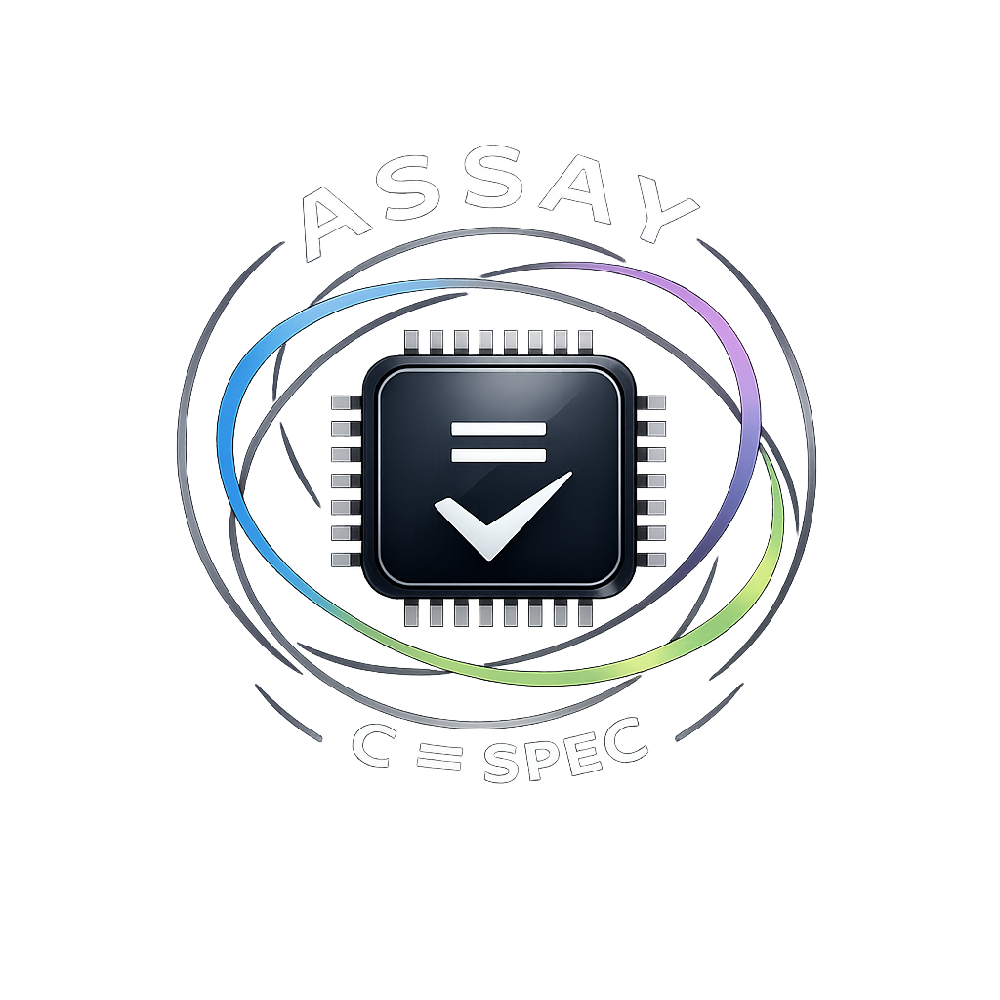

<p align="center">
  
</p>

<h1 align="center">PQC-Assay</h1>
<p align="center"><em>(formerly "Assay")</em></p>

Machine-checking post-quantum reference C against its specification, using the
SAW → Cryptol → Isabelle pipeline.

PQC-Assay runs the same SAW → Cryptol → Isabelle pipeline Apple used for its 2026 `corecrypto` work
against the PQClean reference C for ML-DSA (FIPS 204). It uses none of Apple's code or theories; the
Isabelle spec is written from FIPS 204.

Current scope is the `reduce.c` arithmetic layer and the forward NTT's functional equivalence.
Montgomery reduction is an implementation device the NTT uses; it is not defined in FIPS 204. None of
this is the optimized/assembly code that ships in production (see [Roadmap](docs/ROADMAP.md)).

## What's proven

`make verify` checks both legs (exit 0):

- **SAW (C ≡ Cryptol)** — bit-for-bit:
  - The `reduce.c` layer: `montgomery_reduce` (`−2³¹·Q ≤ a ≤ Q·2³¹`), `reduce32` (`a ≤ 2³¹−2²²−1`),
    `caddq`, `freeze` — these also assert no signed-overflow UB in range.
  - The forward NTT `ntt(a[256])`, under two's-complement wrapping (`-fwrapv`). The NTT does
    unreduced int32 add/sub that overflow for unbounded inputs, so this is functional equivalence,
    not overflow-freedom (which needs coefficient-bound composition — see Roadmap v1.5).

  A mutation test confirms the reduce proof is non-vacuous, and CI diffs the lifted Isabelle model
  against the Cryptol model SAW checks.
- **Isabelle (model ≡ spec)** — `montgomery_reduce` only: the lifted model meets
  `is_montgomery_reduction` (`2³²·r ≡ a (mod Q)` and `−Q < r < Q`) on `−2³¹·Q ≤ a < 2³¹·Q`, no
  `sorry`/`oops`. The others have SAW proofs but not the Isabelle leg yet.

Chained, for `montgomery_reduce`: the C computes a correct Montgomery residue mod Q on that range.

While doing this we found an off-by-one in PQClean's `montgomery_reduce` doc comment: it claims a
strict output bound that fails at one (unreachable) input endpoint. See `docs/ASSUMPTIONS.md`, OF-1.

## Scope and limitations

Two external reviewers (formal methods; applied PQC) read this. Their summary: the proof is correct
and honestly scoped, but it targets the easy function.

- `montgomery_reduce` is the least bug-prone thing in the stack — branch-free, two multiplies and a
  shift, unchanged in pq-crystals for years. ML-DSA's real correctness risk is reduction-bound
  composition across the NTT/InvNTT (e.g. ePrint [2026/1032](https://eprint.iacr.org/2026/1032), an
  optimized-path overflow that passed test vectors; and the missing-reduction bug Apple's SAW work
  caught in ML-DSA InvNTT). A single-primitive proof cannot reach that. The forward NTT with
  coefficient-bound tracking is the next step.
- The verified range (`|a| ≤ 2³¹·Q ≈ 2⁵⁴`) is about 256× wider than anything ML-DSA feeds the
  function (call sites produce `≲ Q² ≈ 2⁴⁶`), which is why OF-1's endpoint never occurs in practice.
- `montgomery_reduce` is identical across ML-DSA-44/65/87, so the "-44" pin is cosmetic and the
  result holds for all three.
- This is reference C. The code that ships (AVX2/aarch64; OpenSSL, BoringSSL, AWS-LC; PQ Code Package
  `mldsa-native`) is different, and verified with other tools (CBMC, HOL-Light). Pointing this
  pipeline at `mldsa-native` is v2.

So: a working end-to-end pipeline on third-party reference C, plus a minor upstream doc fix. Not an
ML-DSA assurance result.

## Background (if formal verification is new to you)

In May 2026 Apple open-sourced the [formal verification of `corecrypto`](https://github.com/apple/corecrypto/tree/2026-05),
the cryptography on Apple devices, covering ML-KEM and ML-DSA (FIPS 203/204). Formal verification here
means a machine-checked proof that the code computes what the spec says for every input, not just the
cases a test happens to hit. Apple used [Galois](https://github.com/GaloisInc/saw-script)'s SAW +
Cryptol and the [Isabelle](https://isabelle.in.tum.de/) prover, and caught bugs that testing had
missed. PQC-Assay applies the same public approach to third-party reference C.

## Pipeline

```
   target C subroutine
          │  (1) hand-translate
          ▼
   Cryptol model  ──(2) SAW: C ≡ Cryptol──►  ✔
          │  (3) cryptol-to-isabelle
          ▼
   Isabelle model ──(4) model ≡ FIPS spec──►  ✔ (montgomery_reduce)
                                  ▲
                  spec written from FIPS 204; no Apple artifacts
```

Detail in [`docs/PIPELINE.md`](docs/PIPELINE.md).

## Reproduce

macOS on Apple Silicon (pinned toolchain; see `docs/ASSUMPTIONS.md`).

```bash
./scripts/setup.sh                   # install pinned SAW, Cryptol, Isabelle, cryptol-to-isabelle
./scripts/setup_isabelle_cryptol.sh  # AFP + build the SAW 'Cryptol' Isabelle session (slow, once)
make verify                          # both legs; non-zero exit = a proof failed
make saw                             # SAW leg only (fast, no Isabelle)
```

## Layout

| Path | What |
|------|------|
| `target/`  | The C under verification, with pinned provenance |
| `model/`   | Cryptol model of the primitives |
| `proof/`   | SAW scripts (C ≡ Cryptol) |
| `spec/`    | Isabelle spec + the equivalence proof |
| `docs/`    | Roadmap, assumptions, pipeline, writeup |
| `scripts/` | Toolchain setup and pipeline orchestration |

## Tools

SAW + Cryptol and `cryptol-to-isabelle` (saw-script 1.5.1) from Galois; Isabelle + AFP. The pipeline
structure follows Apple's published corecrypto approach; no Apple code or theories are used.

## License

Project code: [MIT](LICENSE). The vendored C in `target/` is PQClean/pq-crystals reference code (CC0;
see [`target/README.md`](target/README.md)). The Isabelle spec is original; no Apple artifacts are
included.
